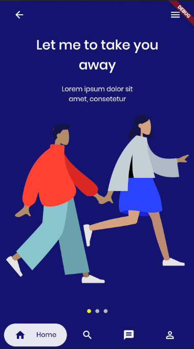

# Onboarding Example

An example of user onboarding, using Flutter. The UI was based off of [Ulvin Omarov](https://www.behance.net/gallery/90841725/Classic-Blue-UI-UX-App-Design)'s design on Behance.

## Preview

### Note
Sorry for the poor documentation, I might add some more later.
